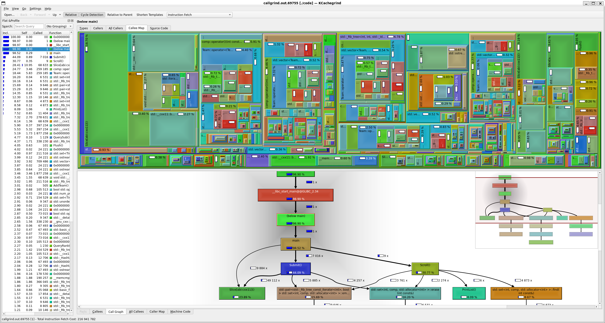

# :trophy:ICPC Management System

> ACM 班 2024 级程序设计课程第二次大作业

## 📖目录

- [:trophy:ICPC Management System](#trophyicpc-management-system)
  - [📖目录](#目录)
  - [🎈简介](#简介)
    - [背景](#背景)
    - [作业目标](#作业目标)
  - [📝作业说明](#作业说明)
    - [🛎分数组成](#分数组成)
      - [A 班](#a-班)
      - [B 班](#b-班)
    - [⏱截止时间](#截止时间)
      - [A 班](#a-班-1)
      - [B 班](#b-班-1)
    - [🔧调试工具](#调试工具)
      - [前置准备](#前置准备)
      - [使用方式](#使用方式)
  - [🚀作业要求](#作业要求)
    - [术语解释](#术语解释)
    - [指令说明](#指令说明)
    - [输入格式](#输入格式)
    - [输出格式](#输出格式)
    - [数据范围](#数据范围)

## 🎈简介

### 背景

**ICPC** （国际大学生程序设计竞赛）由 ICPC 基金会举办的一项旨在展示大学生创新能力、团队精神和在压力下编写程序、分析和解决问题能力的年度竞赛，是最具影响力的大学生计算机竞赛。在 ICPC 比赛中，每个队伍尝试在错误提交次数最少的情况下解答出最多的问题，获胜者为正确解答题目最多且总罚时最少的队伍。

### 作业目标

我们想通过本次作业达到以下目标：

- 学会使用 STL 库
- 加深对于字符串处理的掌握
- 加深对于时间复杂度的理解
- 提高模拟水平，掌握基本的拆分功能、规划项目的能力
- 学会处理边界情况
- 规范代码风格
- 学会自己设计测试数据

因此，你需要实现一个 ICPC 比赛后台系统，通过队伍的提交情况对比赛结果进行维护，具体要求实现的操作见 [作业要求](#作业要求)。

## 📝作业说明

### 🛎分数组成


|                    得分项                     | 分数占比 |
|:------------------------------------------:| :------: |
| 通过 **1986. ICPC Management System (2025)** |   80%    |
|        Code Review 和 **复杂度分析报告提交**         |   20%    |


下面是需要说明的几点：

- 题目 ICPC Management System (2024 B) 的所有测试点的时间限制是 ICPC Management System (2025) 的 **2.5 倍**，除此之外完全相同。

- 在 Code Review 中我们会 **严格审查你的代码风格**，请遵循[代码风格要求](https://acm.sjtu.edu.cn/wiki/C%2B%2B代码风格)。

- 为了训练大家分析时间复杂度的能力，本次作业要求完成一份 **书面复杂度分析报告**，报告提交的截止时间与 OJ 提交的截止时间相同，且在 Code Review 时需要展示你的报告。报告的准确程度会影响你的 Code Review 得分。在报告里，你需要给出你的代码中以下几条指令的时间复杂度，并简要说明你是怎么分析的。设 $N$ 为队伍总数，指令后方标注的是我们所能接受的 **最坏** 时间复杂度（部分指令存在更优方案），如果你的程序对应部分的时间复杂度不能满足要求，Code Review 时将被扣除部分分数。
  - 添加队伍 $O(\log N)$
  - 提交题目 $O(\log N)$
  - 刷新榜单 $O(N\log N)$
  - 滚榜 $O(N\log N)$
  - 查询队伍排名 $O(\log N)$
  - 查询队伍提交情况 $O(\log N)$
  
  报告形式：请使用 Markdown 编写，可以方便地编写数学公式和插入代码。

  **注意**：此处所指的“最坏”时间复杂度仅为最低标准，并没有暗示“只要你的各个指令时间复杂度达到以上最低标准，就一定可以通过 OJ 测试”。即使你们的所有指令达到此最低标准也可能因为各种各样的原因而导致测试超时。因此，请**尽量选择更优的实现方式**而不是仅仅满足于最低标准。
  
- 本次作业提供部分样例数据供同学们测试使用，数据存放在本仓库 `data` 目录下。注意，这些数据并非 Online Judge 上的测试数据点，本地通过所有数据点并不能保证你能够通过 OJ 上的测试。

- 除本地提供的样例数据外，我们也鼓励同学们根据自己的程序逻辑，尝试自己设计测试数据辅助调试。在开发和调试的过程中，你可以 **保存下自己设计过的测试数据** ，并记录下自己遇到过哪些困难的问题，以及最终是如何解决的，我们将会**在 Code Review 时检查**这些内容。

- 本次作业的ddl为*死ddl*，原则上**不接受ddl后的提交**，但如果你没有能够在ddl前通过对应的题目，你也可以通过提交低一档的题目来获得一定的分数，具体如下：
  - A 班同学如果未能通过**1986. ICPC Management System (2025)**，但通过了**1987. ICPC Management System (2024 B)**，将会在此部分获得 **不少于60%** 的分数。

### ⏱截止时间

- ICPC Management System (2025) 与复杂度分析报告：第 8 周周一（10 月 27 日）18:30


### 🔧调试工具

**本章的内容可供参考，也许能够帮助你更好地调试你的代码。**  

与第一次大作业不同，本次大作业对同学们的代码的**时间性能**作出了要求。使用**传统的调试方法**对于检查程序的正确性而言十分有用，但是当你遇见 TLE 时，想要通过传统的调试方法和工具找到占用时间性能较大的部分并做出优化并不容易。在大作业的发布中已经介绍了使用 c++ 中的 `<chrono>` 库进行时间性能检查的方法。为了方便同学们高效地调试自己的代码，本章将介绍另外一种性能分析工具： **callgrind**。相比于 `<chrono>` 库，callgrind 的功能更为强大，可以**可视化**地显示一次程序运行中**每个函数运行时间所占程序运行总时间的百分比**，从而找出作为时间性能瓶颈的具体函数并针对性优化。如果你知道其他好用的性能分析工具，欢迎 PR 到仓库进行分享。

#### 前置准备

首先需要确保你的 wsl 已经安装了 valgrind。终端输入以下指令，若**能够显示版本号**则证明已经安装：
```
valgrind --version
```

否则输入以下指令安装 valgrind：
```
sudo apt update
sudo apt install valgrind
```

安装后验证是否安装成功：
```
valgrind --version
```

推荐使用可视化工具 [KCachegrind](https://kcachegrind.sourceforge.net/html/Home.html) 来查看 callgrind 生成的结果。按照以下方式安装：
```
sudo apt update
sudo apt install kcachegrind
```

安装后验证是否安装成功：
```
kcachegrind --version
```

如果 KCachegrind 运行过程中遇到报错：
```
QStandardPaths: wrong permissions on runtime directory /run/user/1000/, 0755 instead of 0700
QStandardPaths: wrong permissions on runtime directory /run/user/1000/, 0755 instead of 0700
kf.dbusaddons: DBus session bus not found. To circumvent this problem try the following command (with bash):
    export $(dbus-launch)
```

可通过以下指令解决：
```
sudo chmod 0700 /run/user/1000/
export $(dbus-launch)
```

补充：如果搞不定KDE的KCachegrind可以考虑在Windows上运行Qt版本的Kcachegrind，构建好的在[QCachegrind](https://sourceforge.net/projects/qcachegrindwin/)可直接下载。

*Special Thanks: [ChengXi](https://github.com/ChengxiX) for adding QCachegrind to repo*

#### 使用方式

假设你的代码相对路径为 `code.cpp` ，输入文件为 `data/1.in` ，输出到文件 `.out` 。使用时，首先开启调试模式编译你的代码：
```
g++ code.cpp -g -o code
```

然后使用 callgrind 运行代码：
```
valgrind --tool=callgrind ./code <data/1.in >.out
```

由于开启了调试模式，代码运行的时间会变长，可能需要数分钟，请耐心等待运行完成。在运行结束后，你会在当前目录下得到一个名为 `callgrind.out.xxxx` 的文件。将该文件使用 KCachegrind 打开：
```
kcachegrind callgrind.out.xxxx
```

右上选择 Callee Map，右下选择 Call Graph。成功后如下图：


左栏可以查看每个函数的运行时间占比，右侧以可视化的形式展现函数的调用关系。然后检查时间占比较大的函数代码中是否存在可以优化的部分。在图片展示的样例中，能进行优化的函数也许是 `Submit()` 或 `Scroll()`。

以下是一些 callgrind 的其他使用方式，感兴趣可以自行阅读：  
https://blog.csdn.net/CaspianSea/article/details/112653943  
https://www.cnblogs.com/willhua/p/9818530.html

## 🚀作业要求

### 术语解释

由于本次作业涉及到很多专用术语，为了更好地理解后面的指令说明，我们先会对作业中用到的术语进行解释。

- **比赛时间**：我们用 `duration_time` 表示比赛的持续时间，比赛时间范围是闭区间 `[1, duration_time]`，因此，我们可以用该区间中的某个整数，表示比赛过程中的某个时间点。我们仅保证输入数据中的提交时间是 **单调不降** 的，这意味着可能出现 **相同** 的时间。

- **队伍**：每一支参赛队伍都有自己唯一的队伍名称，队名格式为 20 个字符内（含）的大小写字母、数字及下划线的组合。

- **提交**：队伍提交一份解答，经评测机评测后，后台获得这次提交的基本信息。未封榜时的提交会实时更新队伍的状态（如通过题目数量等），但 **并不会更新榜单上队伍的排名**。

- **评测状态**：每次提交都有其对应的评测状态，评测状态可能有以下情况：

  - Accepted
  - Wrong_Answer
  - Runtime_Error
  - Time_Limit_Exceed

  除了 Accepted 算做通过外，剩下的状态均不算做通过。

- **刷新榜单**：更新榜单上队伍的排名。

- **榜单**：按照排名从前到后显示每支队伍的状态。

- **罚时**：一种比较两队伍排名的参数。一个队伍对于某道题目的罚时定义为 $P = 20X + T$ ，其中 $X$ 为该队伍第一次正确提交前的提交次数， $T$ 为该队通过此题的时间，即第一次正确提交的时间。某队伍的罚时定义为该队伍对于其所有 **通过的题目** 的罚时之和。

- **排名**：比赛的排名由多个参数共同决定：
  - 首先，通过题目数多的队伍排名靠前；
  - 当两队通过题目数相同时，我们比较两队的罚时，罚时小者排名靠前；
  - 依旧平局时，我们比较两队通过时间最大的题目的通过时间，最大通过时间较小的一队排名靠前，相同则比较通过时间第二大的题目，依旧相同则比较通过时间第三大的题目……以此类推；
  - 如果依旧平局则比较两支队伍名称的字典序，字典序较小的队伍排名靠前（由于队伍名称是互不相同的，因此两支队伍名称的字典序必有一个小于另一个）。
  - **注意**：以上所有因素均 **不包含冻结状态的题目**（冻结状态见下一条），显而易见，封榜后直到滚榜前排行榜上的排名不会发生改变。
  - 第一次刷新榜单前的排名的依据是队伍名称的字典序。

- **封榜**：封榜后，对于任意一支队伍，所有 **封榜前该队伍未通过的题目**，封榜后的排行榜上并不显示实时的提交结果，而只显示出封榜时间段内该队伍对题目的提交次数，封榜后至少有一次提交的题目将变成 **冻结状态**（封榜前通过的题目，封榜后再次提交不会被冻结）。

- **滚榜**：滚榜环节中，每次在排行榜上选择一支排名最靠后且有冻结状态题目的队伍，并选择该队伍编号最小的一道冻结状态的题目进行解冻，并重新计算排名，更改排行榜上的排名状态（滚榜操作中会首先刷新榜单再进行之后的操作）。之后在更新过的排行榜上，再次选择排名最靠后且有冻结状态题目的队伍，重复上述解冻操作，直到所有队伍都不存在仍处于冻结状态的题目。这样，我们就得到了当前正确的榜单。
  - **注意**：与实际比赛不同的是，本次作业中一次比赛内可以进行多次封榜、滚榜。每次滚榜必须在封榜状态下才能执行；滚榜结束后，封榜状态将被解除，之后可以再次封榜。


### 指令说明

所有的指令格式由下方的代码框给出，全大写部分代表命令，中括号 `[]` 内的小写部分代表对应参数（括号并不会出现在输入中）。

```plain
# 添加队伍
ADDTEAM [team_name]

# 开始比赛
START DURATION [duration_time] PROBLEM [problem_count]

# 提交题目
SUBMIT [problem_name] BY [team_name] WITH [submit_status] AT [time]

# 刷新榜单
FLUSH

# 封榜
FREEZE

# 滚榜
SCROLL

# 查询队伍排名
QUERY_RANKING [team_name]

# 查询队伍提交情况
QUERY_SUBMISSION [team_name] WHERE PROBLEM=[problem_name] AND STATUS=[status]

# 结束比赛
END
```

- 添加队伍
  - `ADDTEAM [team_name]`
  - 向系统中添加队伍。
    - 成功添加输出 `[Info]Add successfully.\n`
    - 若比赛已开始，输出 `[Error]Add failed: competition has started.\n`
    - 若比赛未开始但队伍名重复，输出 `[Error]Add failed: duplicated team name.\n`


- 开始比赛
  - `START DURATION [duration_time] PROBLEM [problem_count]`
  - 开始比赛，比赛时间范围为闭区间 `[1, duration_time]` ，题号范围为前 `problem_count` 个大写英文字母。
    - 成功开始则输出 `[Info]Competition starts.\n`
    - 若比赛已开始，输出 `[Error]Start failed: competition has started.\n`

**保证以下全部操作均在开始比赛之后出现。**

- 提交题目

  - `SUBMIT [problem_name] BY [team_name] WITH [submit_status] AT [time]`
  - 保证输入合法，记录 `team_name` 在 `time` 时刻对题目 `problem_name` 的一次提交，评测状态为 `submit_status` 。
    - `submit_status` 可能有以下情况：Accepted，Wrong_Answer，Runtime_Error，Time_Limit_Exceed。除了 Accepted 算做通过外，剩下的状态均不算做通过。保证 `time` 按照提交出现的顺序单调（非严格）上升。
    - 本条指令无输出。

- 刷新榜单

  - `FLUSH`
  - 刷新当前榜单。
    - 输出 `[Info]Flush scoreboard.\n`

- 封榜

  - `FREEZE`
  - 进行封榜操作。
    - 成功则输出 `[Info]Freeze scoreboard.\n`
    - 若已封榜但未滚榜，则输出 `[Error]Freeze failed: scoreboard has been frozen.\n`

- 滚榜

  - `SCROLL`
    - 若未封榜，则输出 `[Error]Scroll failed: scoreboard has not been frozen.`
    - 若已封榜，则可以开始滚榜，
      - 首先输出提示语 `[Info]Scroll scoreboard.\n`，
      - 然后输出 **滚榜前** 的榜单（此榜单为**刷新后**的榜单），
      - 接着每一行输出滚榜时 **导致排名变化** 的解冻，
      - 最后输出 **滚榜后** 的榜单。
    - 排名变化的输出格式如下：

      ```plain
      [team_name1] [team_name2] [solved_number] [penalty_time]
      ```

      `team_name1` 表示题目解冻导致排名上升的队伍， `team_name2` 表示排名被 `team_name1` 取代的队伍（即题目解冻前处在`team_name1`排名上升后的名次的队伍）， `solved_number` 和 `penalty_time` 为 `team_name1` 新的解题数和罚时；
    - 榜单的输出格式如下：
      输出 $N$ （队伍总数）行，每行以

      ```plain
      队名 排名 解题数 总罚时 A B C ...
      ```

      的格式表示一支队伍的情况，其中“A B C ...”表示每一题的情况，有以下三种可能：

      - 该题未被冻结且已经通过：
        - 显示 `+x`，其中 `x` 表示该题第一次通过前错误的次数
        - 如果 `x` 为 0，则显示 `+` 而不是 `+0`
      - 该题未被冻结但没有通过：
        - 显示 `-x`，其中 `x` 表示该题错误的次数
        - 如果 `x` 为 0（即此队伍还没有提交过此题），则显示 `.` 而不是 `-0`
      - 该题被冻结：
        - 显示 `-x/y`，其中 `x` 表示封榜前错误的次数，`y` 表示封榜后的提交次数。
        - 如果 `x` 为 0，则显示 `0/y` 而不是 `-0/y`

- 查询队伍排名

  - `QUERY_RANKING [team_name]`

    - 查询对应队伍排名。

    - 若队伍不存在，则输出 `[Error]Query ranking failed: cannot find the team.\n`

    - 若队伍存在，则输出 `[Info]Complete query ranking.\n`。此时若处在封榜状态，则需要输出一行 `[Warning]Scoreboard is frozen. The ranking may be inaccurate until it were scrolled.\n`。不论是否封榜，输出上一次刷新榜单后的队伍排名，格式如下：

      ```plain
      [team_name] NOW AT RANKING [ranking]
      ```

- 查询队伍提交情况

  - `QUERY_SUBMISSION [team_name] WHERE PROBLEM=[problem_name] AND STATUS=[status]`

    - 查询对应队伍的满足条件的最后一次提交。**封榜后的提交可以被查询到。**

      以下是可参考以下合法示例：

      ```plain
      # 查询 Team_Rocket 的最后一次提交
      QUERY_SUBMISSION Team_Rocket WHERE PROBLEM=ALL AND STATUS=ALL
      
      # 查询 Team_Plasma 的最后一次状态为 Accepted 的提交
      QUERY_SUBMISSION Team_Plasma WHERE PROBLEM=ALL AND STATUS=Accepted

      # 查询 Pokemon_League 的最后一次对题目 A 的提交
      QUERY_SUBMISSION Pokemon_League WHERE PROBLEM=A AND STATUS=ALL

      # 查询 Opelucid_Gym 队的最后一次对 M 题状态为 Runtime_Error 的提交
      QUERY_SUBMISSION Opelucid_Gym WHERE PROBLEM=M AND STATUS=Runtime_Error
      ```

    - 若队伍不存在，则输出 `[Error]Query submission failed: cannot find the team.\n`

    - 若队伍存在 `[Info]Complete query submission.\n`

      - 若无满足条件的提交，输出 `Cannot find any submission.\n`

      - 若有满足条件的提交，输出一行表示最后一次满足条件的提交，格式如下：

        ```plain
        [team_name] [problem_name] [status] [time]
        ```

        `problem_name` 为该次提交的题目编号，`status` 为该次提交的状态，`time` 为该次提交的时间。保证询问中的 `problem_name` 与 `status` 格式合法。

- 结束比赛
  - `END`
    - 结束比赛。
      - 输出 `[Info]Competition ends.\n`。保证结束比赛时排行榜不处于封榜状态，且之后没有任何操作。

### 输入格式

- 程序开始运行后，会读入若干个指令，直到读入 `END` 指令为止。
- 保证命令格式合法（但不保证命令所执行的内容合法，具体可参见上文）。


### 输出格式

按照指令说明部分所要求的格式输出。

### 数据范围

对于 60% 的数据，队伍总数 $N \le 500$ ，操作次数 $\mathit{opt}\le 10^4$ 。

对于 100% 的数据，队伍总数 $N \le 10^4$，题目总数 $M \le 26$ ，比赛时长 $T \le 10^5$ ，操作次数 $\mathit{opt}\le 3\times 10^5$ ，刷新榜单次数 $\mathit{opt_{flush}} \le 1000$ 。封榜次数 $\mathit{opt_{freeze}}\le 10$ 。

